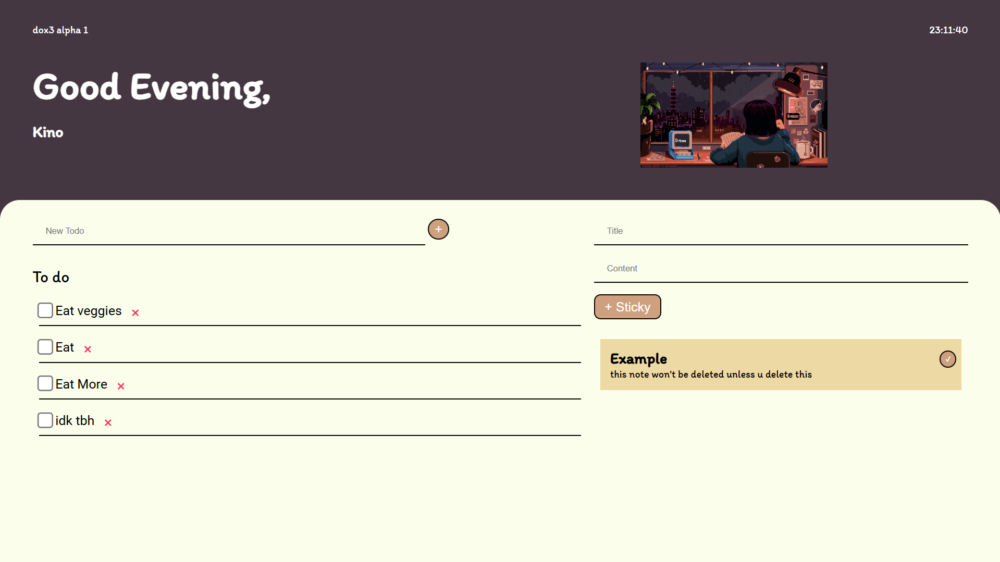

# dox3  
### `To do list`  
  
# How to start
`cd dox3`  
to start the frontend:  
`npm run dev` or `npm run build`  
to start the backend:  
`cd server`  
`node app.js`
# Features  
- To do list
- Clock (literally)
- Sticky Notes
# Upcoming Features  
- Timer
- Desktop App
- Lofi Songs
- Customizable Color
- Username
- Lofi SFX
# Sticky Note API Documentation

## Base URL
```
http://localhost:3000/api
```

## Endpoints

### Create a new story

- **URL:** `/stories`
- **Method:** `POST`
- **Request Body:**
  ```json
  {
    "title": "Story Title",
    "content": "Story Content"
  }
  ```
- **Response:**
  - **Status:** `200 OK`
  - **Body:**
    ```json
    {
      "id": 1
    }
    ```
- **Description:** Creates a new story and returns the ID of the newly created story.

### Read all stories

- **URL:** `/stories`
- **Method:** `GET`
- **Response:**
  - **Status:** `200 OK`
  - **Body:**
    ```json
    {
      "stories": [
        {
          "id": 1,
          "title": "Story Title",
          "content": "Story Content"
        }
      ]
    }
    ```
- **Description:** Retrieves a list of all stories.

### Read a single story by ID

- **URL:** `/stories/:id`
- **Method:** `GET`
- **URL Parameters:**
  - `id` (integer): The ID of the story to retrieve.
- **Response:**
  - **Status:** `200 OK`
  - **Body:**
    ```json
    {
      "story": {
        "id": 1,
        "title": "Story Title",
        "content": "Story Content"
      }
    }
    ```
- **Description:** Retrieves the details of a single story by ID.

### Update a story by ID

- **URL:** `/stories/:id`
- **Method:** `PUT`
- **URL Parameters:**
  - `id` (integer): The ID of the story to update.
- **Request Body:**
  ```json
  {
    "title": "Updated Title",
    "content": "Updated Content"
  }
  ```
- **Response:**
  - **Status:** `200 OK`
  - **Body:**
    ```json
    {
      "changes": 1
    }
    ```
- **Description:** Updates the details of a story by ID and returns the number of changes.

### Delete a story by ID

- **URL:** `/stories/:id`
- **Method:** `DELETE`
- **URL Parameters:**
  - `id` (integer): The ID of the story to delete.
- **Response:**
  - **Status:** `200 OK`
  - **Body:**
    ```json
    {
      "changes": 1
    }
    ```
- **Description:** Deletes a story by ID and returns the number of changes.

## Example Usage

### Create a new story

```bash
curl -X POST http://localhost:3000/api/stories -H "Content-Type: application/json" -d '{"title":"My First Story","content":"This is the content of my first story."}'
```

### Read all stories

```bash
curl -X GET http://localhost:3000/api/stories
```

### Read a single story by ID

```bash
curl -X GET http://localhost:3000/api/stories/1
```

### Update a story by ID

```bash
curl -X PUT http://localhost:3000/api/stories/1 -H "Content-Type: application/json" -d '{"title":"Updated Title","content":"Updated Content"}'
```

### Delete a story by ID

```bash
curl -X DELETE http://localhost:3000/api/stories/1
```
